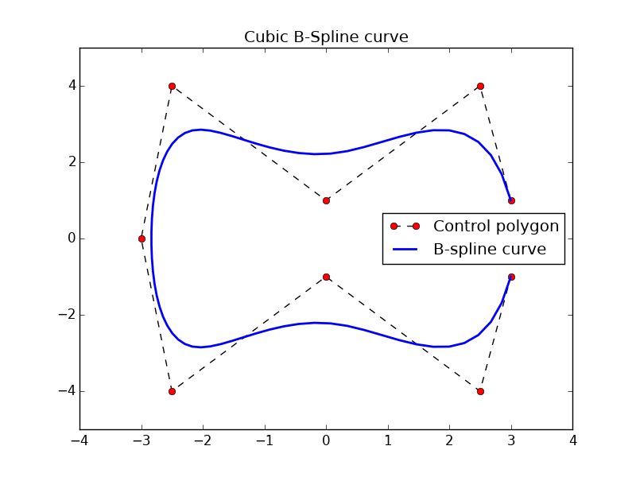
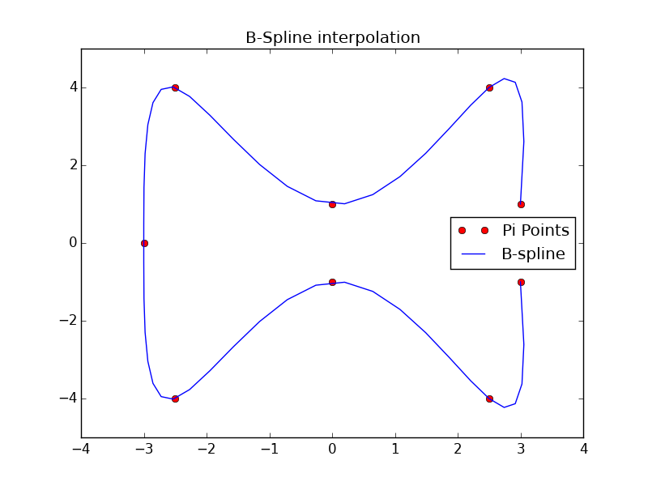

# Python-B-spline-examples

Examples in Python about evaluating and interpolating a B-spline curve and their comparaison using Numpy, Scipy and Matplotlib.

### **Requirements**


* Python 2.7.x or 3.x.x,
* Numpy
* Scipy 
* Matplotlib


## Getting hands dirty

Assuming you already know a little about B-spline curves, otherwise google it or [check this out](http://web.mit.edu/hyperbook/Patrikalakis-Maekawa-Cho/node17.html).

Let consider a 9 points list named __plist__ :

```python
plist = [(3 , 1), (2.5, 4), (0, 1), (-2.5, 4),(-3, 0), (-2.5, -4), (0, -1), (2.5, -4), (3, -1),]
```

We will do two things : 

* A. Drawing a cubic B-Spline curve where __plist__ is the control polygon.

* B. Find(interpolate) and draw the B-spline curve that go trough __plist__ points and or in other words __a curve fitting__ using a cubic B-spline curve.

As we will work with Numpy , let's create a numpy array named __ctr__ from __plist__  ,and then split it into __x__ and __y__ arrays.
```python
ctr =np.array(plist)

x=ctr[:,0]
y=ctr[:,1]

```
## **A. Drawing the B-spline Curve**

We will draw a cubic B-spline which degree __k__=3 as it's the most used one.
We need now to define the __knots vector__, with __k__ ending equal knots:  

```python
l=len(x)
t=np.linspace(0,1,l-2,endpoint=True)
t=np.append([0,0,0],t)
t=np.append(t,[1,1,1])
```
Now we have defined all requirement to draw it. we can construct a sequence of length 3 containing the knots, coefficients, and degree of the spline to pass it as the __tck__ argument to [scipy.interpolate.splev](http://docs.scipy.org/doc/scipy/reference/generated/scipy.interpolate.splev.html#scipy.interpolate.splev) , the function that will evaluate our curve: 

```python
tck=[t,[x,y],3]
```
And as we will evaluate the B-spline curve, we need a second parameter__u__ , an array of points :
```python
u3=np.linspace(0,1,(max(l*2,70)),endpoint=True)
``` 

And we evaluate it :
```python
out = interpolate.splev(u3,tck) 
``` 

Drawing it using matplotlib : 



With this code : 

```python
plt.plot(x,y,'k--',label='Control polygon',marker='o',markerfacecolor='red')
plt.plot(out[0],out[1],'b',linewidth=2.0,label='B-spline curve')
plt.legend(loc='best')
plt.axis([min(x)-1, max(x)+1, min(y)-1, max(y)+1])
plt.title('Cubic B-spline curve evaluation')
plt.show()
```


## **B. interpolate the B-spline Curve**

We will interpolate now the B-spline cruve that should go through n points. 
As we done before, a numpy array must be created using __plist__ and split into x and y arrays : 

```python
plist = [(3 , 1), (2.5, 4), (0, 1), (-2.5, 4),(-3, 0), (-2.5, -4), (0, -1), (2.5, -4), (3, -1),]

ctr =np.array(plist)

x=ctr[:,0]
y=ctr[:,1]

```
To interpolate the B-spline that go through this points. To do so, we will be using __scipy.interpolate.splprep__, to get the interpolated S-pline parameters :
```python
tck,_=interpolate.splprep([x,y],k=3,s=0)
```
And we use them to evaluate it using __scipy.interpolate.splev__, we still have a to redefine __u__ variable to get a clear plot :
```python
u=np.linspace(0,1,num=50,endpoint=True)
out = interpolate.splev(u,tck)
```

and we finaly draw it :


With this code : 
```python
plt.figure()
plt.plot(x, y, 'ro', out[0], out[1], 'b')
plt.legend(['Points', 'Interpolated B-spline', 'True'],loc='best')
plt.axis([min(x)-1, max(x)+1, min(y)-1, max(y)+1])
plt.title('B-Spline interpolation')
plt.show()
```

## **Full code :** 

###  B-Spline evalutation

```python

import numpy as np
from scipy import interpolate

import matplotlib.pyplot as plt


ctr =np.array( [(3 , 1), (2.5, 4), (0, 1), (-2.5, 4),
                (-3, 0), (-2.5, -4), (0, -1), (2.5, -4), (3, -1),])
x=ctr[:,0]
y=ctr[:,1]

# uncomment both lines for a closed curve
#x=np.append(x,[x[0]])  
#y=np.append(y,[y[0]])

l=len(x)  

t=np.linspace(0,1,l-2,endpoint=True)
t=np.append([0,0,0],t)
t=np.append(t,[1,1,1])

tck=[t,[x,y],3]
u3=np.linspace(0,1,(max(l*2,70)),endpoint=True)
out = interpolate.splev(u3,tck)

plt.plot(x,y,'k--',label='Control polygon',marker='o',markerfacecolor='red')
#plt.plot(x,y,'ro',label='Control points only')
plt.plot(out[0],out[1],'b',linewidth=2.0,label='B-spline curve')
plt.legend(loc='best')
plt.axis([min(x)-1, max(x)+1, min(y)-1, max(y)+1])
plt.title('Cubic B-spline curve evaluation')
plt.show()
```

###  B-Spline interpolation

```python
import numpy as np
from scipy import interpolate

import matplotlib.pyplot as plt

#x = np.arange(0, 2*np.pi+np.pi/4, 2*np.pi/8)
#y = np.sin(x)

ctr =np.array( [(3 , 1), (2.5, 4), (0, 1), (-2.5, 4),
                (-3, 0), (-2.5, -4), (0, -1), (2.5, -4), (3, -1)])

x=ctr[:,0]
y=ctr[:,1]

#x=np.append(x,x[0])
#y=np.append(y,y[0])

tck,u = interpolate.splprep([x,y],k=3,s=0)
u=np.linspace(0,1,num=50,endpoint=True)
out = interpolate.splev(u,tck)

plt.figure()
plt.plot(x, y, 'ro', out[0], out[1], 'b')
plt.legend(['Points', 'Interpolated B-spline', 'True'],loc='best')
plt.axis([min(x)-1, max(x)+1, min(y)-1, max(y)+1])
plt.title('B-Spline interpolation')
plt.show()
```

You can comment about it [here](http://kaoua.ch/how-to-draw-and-interpolate-a-b-spline-curve-on-python.html)


**Please help improving this code.**
